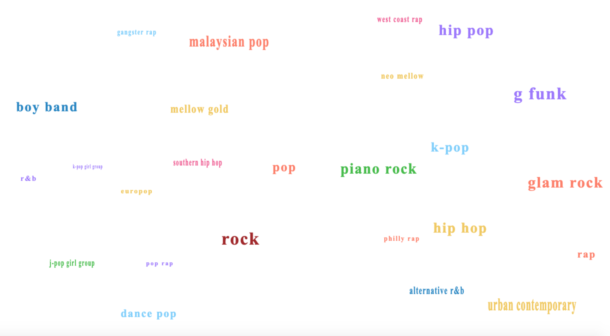

Canvas Boilerplate is the go-to solution for quickly creating modern canvas pieces using ES6 and webpack.

Here's a test project where I played with getting words to bounce around a screen. It has the follwing features:

- Iterates through an array of genres and generates an object for each 
- All objects have a randomized color, size, and velocity and which its moving
- When you hover over a word, the word stops moving and a filled circle of light opactity appears
- Once you move your mouse off the word, it is eventually hit by one of the other bouncing words and gains velocity
- If you click on a word, it logs the word you clicked on

## Getting Started

1.  Clone the repo:

        git clone https://github.com/christopher4lis/canvas-boilerplate.git

2.  Install dependencies:

        yarn

    or

        npm install

3.  Run webpack:

        npm start

Your canvas piece should open up automatically at http://localhost:3000 and you should see 'HTML CANVAS BOILERPLATE' on hover.
